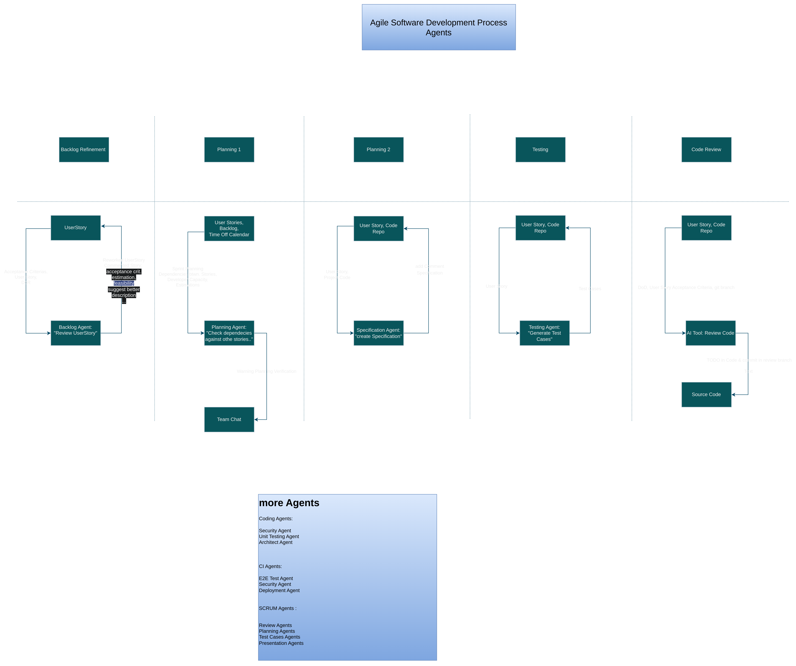

# scrum_agents

# AI Supported Software Development Process

 
---

### 🔍 What does the image show?

The diagram illustrates an **AI-agent-based workflow** for **agile software development**, aligned with the typical **SCRUM process phases**:

1. **Backlog Refinement**
2. **Planning 1**
3. **Planning 2**
4. **Testing**
5. **Code Review**

At each stage, **specialized AI agents** are embedded into the process. These agents assist with tasks such as reviewing user stories, identifying dependencies, generating test cases, and reviewing source code — often automatically and in real-time.

---

### 🤖 Examples of AI Agents in Action

| Phase              | AI Agent               | Responsibility                                                           |
| ------------------ | ---------------------- | ------------------------------------------------------------------------ |
| Backlog Refinement | `Backlog Agent`        | Reviews acceptance criteria, detects issues, suggests improvements       |
| Planning           | `Planning Agent`       | Checks dependencies, developer capacity, supports sprint planning        |
| Specification      | `Specification Agent`  | Adds structured specification to code repositories                       |
| Testing            | `Testing Agent`        | Automatically generates test cases based on user stories                 |
| Code Review        | `AI Tool: Review Code` | Conducts automated code reviews based on Definition of Done and criteria |

---

### ✅ Key Benefits

1. **Increased Productivity**
   Routine work is automated, allowing the development team to focus on complex or creative tasks.

2. **Higher Quality through Automation**
   Consistent application of test generation, specification, and review leads to fewer errors.

3. **Faster Iterations**
   Agents provide real-time feedback during planning, coding, and reviewing.

4. **Better Traceability**
   Every step and AI-generated comment is documented, traceable, and linked to user stories or commits.

5. **Continuous Improvement**
   Agents can learn from review results and refine their output (e.g., test quality, code suggestions).

---

### 🌟 Innovative Aspects

* **AI-First Development Pipeline**
  Agents are not just tools—they act as **collaborative team members** in the development process.

* **SCRUM-Integrated Agent Roles**
  Specific agents map to SCRUM roles and activities, like planning, reviews, and presentations.

* **Highly Specialized Agents**
  Each agent has a single, focused task—similar to microservice design principles.

* **Seamless CI/CD Integration**
  This agent structure is ideal for extending into automated DevOps pipelines (e.g., testing, deployment, security scans).

---

Would you like a follow-up version of this explanation tailored for a **stakeholder presentation**, **technical documentation**, or **developer onboarding**?

https://www.linkedin.com/in/andre-rochlitz-a747795b/